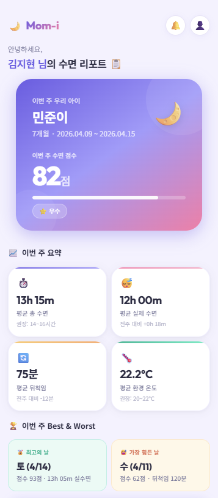
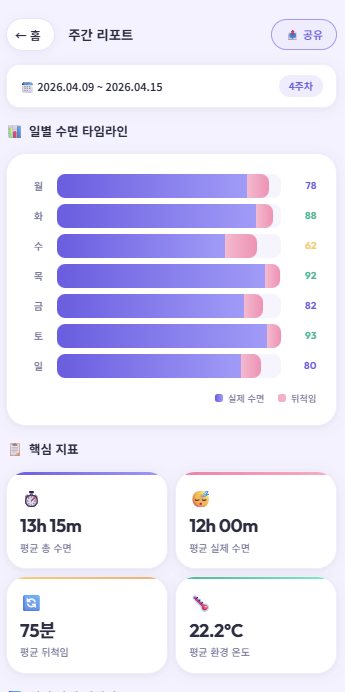
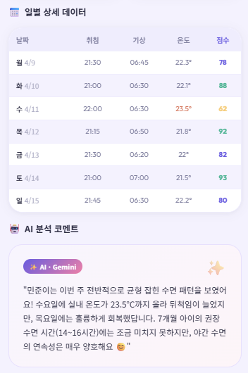
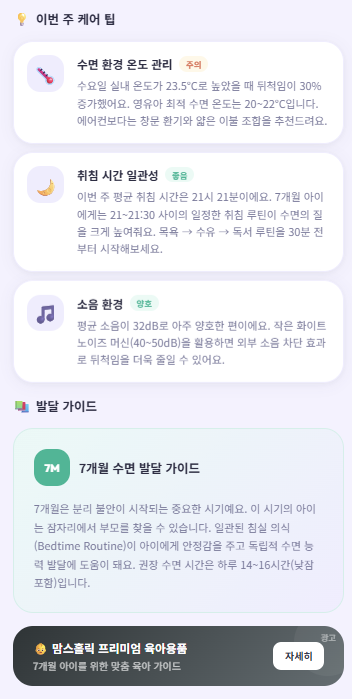
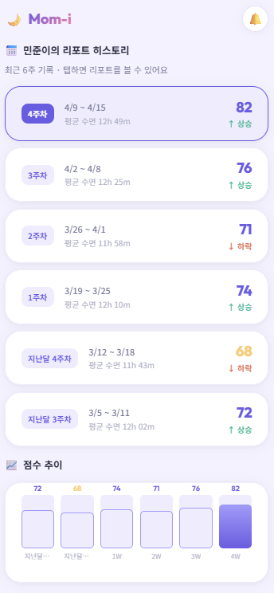

# 맘아이 리포트 시스템 — 팀 회의 자료

| 항목 | 내용 |
|------|------|
| **작성일** | 2026-04-19 |
| **작성자** | 노호종 (AI 리포트 담당) |
| **회의 목적** | 리포트 UI 구현을 위한 미결 사항 공동 결정 |
| **참고 자료** | `docs/image/1~6.png` (Notion 리포트 UI 목업) |

---

## 0. 회의 배경

현재 리포트 서버는 수면·환경·호흡·체온 데이터를 받아 Gemini AI로 주간 리포트를 생성하는 기능이 완성되어 있다.

그러나 Notion에 공유된 **앱 UI 목업**을 분석한 결과, 현재 API만으로는 구현할 수 없는 요소가 다수 존재한다.
이 회의에서 역할별 담당자가 아래 사항들을 확정해야 개발을 진행할 수 있다.

---

## 1. UI 목업 vs 현재 API — 갭 전체 분석

### 1-1. 홈 화면 (요약 카드)



| UI 요소 | 현재 API 지원 여부 | 비고 |
|---------|------------------|------|
| 아이 이름 (민준이) | ❌ 없음 | 리포트 서버는 개인정보 미보관 원칙. 앱이 자체 보유 |
| 월령 (7개월) | ✅ `baby_age_months` | |
| 주차 범위 (4/9~4/15) | ✅ `week_start` | 종료일은 week_start + 6일로 앱이 계산 |
| **수면 점수 (82점)** | ❌ 없음 | **산식 결정 필요 → 의제 #1** |
| **우수 등급 뱃지** | ❌ 없음 | 점수 구간별 등급 기준 필요 |
| 평균 총 수면 (13h 15m) | ✅ `summary.avg_sleep_h` | |
| **평균 실제 수면 (12h 00m)** | ⚠️ 계산 가능 | 총 수면 − 뒤척임. 응답 필드 추가 여부 결정 필요 |
| 전주 대비 수면 (+0h 18m) | ✅ `trend.sleep_vs_last_week` | |
| 평균 뒤척임 (75분) | ✅ `summary.avg_restless_min` | |
| 전주 대비 뒤척임 (-12분) | ✅ `trend.restless_vs_last_week` | |
| 평균 환경 온도 (22.2°C) | ✅ `environment.temp_avg` | |
| **Best 날 / Worst 날** | ❌ 없음 | 일별 점수 없으면 산출 불가 → 의제 #1 선결 |

---

### 1-2. 주간 리포트 상세 화면



| UI 요소 | 현재 API 지원 여부 | 비고 |
|---------|------------------|------|
| 일별 수면 바 차트 (수면+뒤척임) | ✅ `daily[].sleep_h / restless_min` | |
| **일별 점수 (78/88/62...)** | ❌ 없음 | 점수 산식 필요 → 의제 #1 |
| 핵심 지표 카드 4개 | ✅ summary 필드들 | |

---

### 1-3. 일별 상세 데이터 테이블



| UI 요소 | 현재 API 지원 여부 | 비고 |
|---------|------------------|------|
| **취침 시각 (21:30)** | ❌ 없음 | EMTAKE 프로토콜 확인 필요 → 의제 #2 |
| **기상 시각 (06:45)** | ❌ 없음 | 동일 |
| 일별 온도 | ✅ env_json에서 추출 가능 | 현재는 주간 평균만 응답에 포함 |
| **일별 점수** | ❌ 없음 | 점수 산식 필요 → 의제 #1 |
| AI 분석 코멘트 | ✅ `ai_comment` (텍스트) | 카드형 분리는 → 의제 #3 |

---

### 1-4. 케어 팁 & 발달 가이드



| UI 요소 | 현재 API 지원 여부 | 비고 |
|---------|------------------|------|
| 케어 팁 카드 (제목+뱃지+내용) | ⚠️ 텍스트 내 포함 | 구조화 JSON 여부 → 의제 #3 |
| 상태 뱃지 (주의/좋음/양호) | ❌ 없음 | AI 출력 형식 변경 필요 → 의제 #3 |
| **발달 가이드 (7개월 기준)** | ❌ 없음 | 고정 콘텐츠 vs AI 생성 → 의제 #4 |

---

### 1-5. 리포트 히스토리



| UI 요소 | 현재 API 지원 여부 | 비고 |
|---------|------------------|------|
| **6주치 이력** | ⚠️ 현재 3주 | 보존 기간 연장 필요 → 의제 #5 |
| 주차별 점수 | ❌ 없음 | 점수 산식 필요 → 의제 #1 |
| 상승/하락 방향 표시 | ⚠️ 점수 있으면 가능 | |
| **점수 추이 바 차트** | ❌ 없음 | 히스토리 응답에 점수 필드 추가 필요 |

---

## 2. 의제별 상세

---

### 의제 #1 — 수면 점수 산식 확정
**담당:** 도메인 지식 전문가  
**난이도:** 높음 (전체 UI의 핵심)  
**선결 조건:** 이것이 결정되어야 Best/Worst, 일별 점수, 히스토리 점수 추이가 모두 구현 가능

**현황:**
현재 API에 점수 개념이 없다. UI 목업에서는 82점(우수), 일별 78/88/62점, 6주 추이 차트가 보이며 이것이 사용자 참여의 핵심 지표로 보인다.

**결정해야 할 사항:**

#### A. 점수 구성 지표와 가중치

아래는 논의 시작점으로 제안하는 초안이다. 수치는 전문가 검토 후 확정:

| 지표 | 제안 가중치 | 계산 방식 |
|------|------------|-----------|
| 수면 시간 달성률 | 40% | 월령별 권장 수면 대비 실제 수면 비율 |
| 뒤척임 비율 | 25% | 총 수면 대비 뒤척임 시간 비율 (낮을수록 고점) |
| 환경 점수 | 20% | 온도(권장 18~22°C) + 소음(권장 50dB 이하) |
| 호흡/체온 정상 여부 | 15% | is_normal + status 판정 결과 |

#### B. 월령별 점수 기준이 달라지는가?

```
예시:
  7개월 기준 권장 수면: 14~16시간
  실제 수면 13h 15m → 달성률 = 13.25 / 15 = 88%
```

월령별 기준값이 달라지면 같은 수면 시간이라도 점수가 달라진다. 이 방식이 맞는지 확인 필요.

#### C. 점수 구간별 등급

| 점수 | 등급 | 색상(앱팀 참고) |
|------|------|----------------|
| 90~100 | 최우수 | |
| 80~89 | 우수 | |
| 70~79 | 보통 | |
| 60~69 | 주의 | |
| 60 미만 | 개선 필요 | |

#### D. 일별 점수 산출 방식

주간 점수와 동일한 공식을 일별로 적용하는가? 또는 일별은 단순화된 공식을 쓰는가?

```
일별 점수 = 해당 날 수면 시간 달성률 + 뒤척임 비율 (환경/호흡 일별 데이터 없으면 제외)
```

**⚠️ 이 의제가 결정되지 않으면:** 히스토리 화면, Best/Worst 날, 점수 추이 차트, 일별 상세 테이블 점수 컬럼을 모두 구현할 수 없다.

---

### 의제 #2 — 취침/기상 시각 데이터 수신 가능 여부
**담당:** 백엔드 공통 + EMTAKE 담당  
**난이도:** 중간

**현황:**
UI 일별 상세 테이블에 `취침 21:30 / 기상 06:45` 형태의 시각이 표시된다. 현재 EMTAKE 프로토콜 `CMD: SleepData`에는 `day_gs`(수면 시간), `day_pr`(뒤척임)만 있고 취침·기상 시각 필드가 없다.

**결정해야 할 사항:**

| 옵션 | 설명 | 작업량 |
|------|------|--------|
| A. EMTAKE에 시각 필드 추가 요청 | 엠테이크 측에 `sleep_start_time`, `wake_time` 필드 추가 협의 | 엠테이크 대응 필요 |
| B. 맘아이 서버가 변환해서 전달 | 맘아이 서버가 시각 계산 후 리포트 서버로 넘김 | 맘아이 서버 수정 |
| C. 해당 UI 요소 제거 | 취침/기상 시각 없이 수면 시간(분)만 표시 | 앱 UI 수정 |

**권장:** EMTAKE 원본 데이터에 시각이 없으면 C안이 현실적. A안은 협의 기간이 길어질 수 있음.

---

### 의제 #3 — AI 코멘트 출력 형식: 텍스트 vs 구조화 JSON
**담당:** AI 리포트 담당(노호종) + 앱팀  
**난이도:** 중간

**현황:**
현재 `ai_comment`는 아래처럼 마크다운 텍스트 한 덩어리로 반환된다.

```
### 이번 주 총평
이번 주 아기는 전반적으로 균형 잡힌 수면 패턴을 보였어요...

### 수면 패턴 분석
수요일 실내 온도가 23.5°C로...

### 호흡 및 체온 분석
...

### 환경 영향 분석
...

### 부모 조언
...
```

UI 목업에서는 케어 팁이 **카드 형태로 분리**되고 각각 **주의/좋음/양호 뱃지**가 붙어 있다.

**선택지:**

#### A안 — 현재 텍스트 유지 (앱이 파싱)
- 앱이 `###` 기준으로 섹션을 분리해서 렌더링
- 뱃지는 앱이 키워드 탐지로 직접 판단 ("주의", "위험", "양호" 등)
- **리포트 서버 수정 없음**
- 앱 파싱 로직 구현 필요

#### B안 — 구조화 JSON 출력 (Gemini 형식 변경)
Gemini가 아래 형식으로 출력하도록 프롬프트 변경:

```json
{
  "overall": "이번 주 아기는 전반적으로...",
  "sleep_analysis": "수면 패턴은...",
  "breath_temp_analysis": "호흡수는...",
  "environment_analysis": "환경적으로...",
  "care_tips": [
    {
      "title": "수면 환경 온도 관리",
      "status": "주의",
      "content": "수요일 실내 온도가 23.5°C로..."
    },
    {
      "title": "취침 시간 일관성",
      "status": "좋음",
      "content": "이번 주 평균 취침 시간은..."
    }
  ]
}
```

- **앱 렌더링 단순화** (파싱 없이 JSON 그대로 사용)
- Gemini JSON 출력 안정성 확보를 위한 검증 로직 추가 필요
- 리포트 서버 프롬프트 + 응답 스키마 수정 필요

**권장:** B안이 앱팀 입장에서 훨씬 편하지만, Gemini JSON 출력 신뢰도 테스트 선행 필요. 앱팀 의견 청취 후 결정.

---

### 의제 #4 — 발달 가이드 구현 방식
**담당:** 도메인 지식 전문가 + AI 리포트 담당  
**난이도:** 낮음

**현황:**
UI 목업에 "7개월 수면 발달 가이드"처럼 월령별 발달 정보 섹션이 있다.

**선택지:**

| 방식 | 설명 | 장단점 |
|------|------|--------|
| A. 고정 콘텐츠 DB 저장 | 도메인 전문가가 월령별 텍스트 작성 → DB 또는 코드에 저장 | 품질 일정, 수정 번거로움 |
| B. Gemini가 매번 생성 | 기존 ai_comment와 함께 발달 가이드 섹션 추가 | 편리하지만 매번 내용 다를 수 있음 |
| C. 별도 API 엔드포인트 | `GET /api/v1/report/guide/{baby_age_months}` | 앱이 필요할 때만 호출 |

**권장:** 초기에는 B안(Gemini 생성)으로 빠르게 구현 후, 품질 검증 후 A안으로 전환 검토.

---

### 의제 #5 — 리포트 보존 기간: 3주 vs 6주
**담당:** 백엔드 공통  
**난이도:** 낮음 (코드 수정 1줄)

**현황:**
- 현재 서버: 매주 월요일 10:00에 3주 초과 데이터 자동 삭제
- UI 히스토리 화면: 최근 6주치 표시

**비교:**

| 기간 | DB 용량 | 히스토리 화면 |
|------|---------|--------------|
| 3주 (현재) | 최소 | 3개만 표시 |
| 6주 | 2배 | 6개 표시 (UI 목업 그대로) |
| 무기한 | 무제한 증가 | 전체 이력 |

**결정 필요:** 6주로 늘릴 경우 코드 수정은 `scheduler.py`와 `report_repo.py`에서 `timedelta(weeks=3)` → `timedelta(weeks=6)` 변경으로 완료 가능. DB 비용/용량 정책 확인 후 결정.

---

## 3. 결정 사항 우선순위 및 담당 매핑

```
🔴 P0 — 다른 모든 것의 선결 조건
  의제 #1  수면 점수 산식          → 도메인 지식 전문가 확정 필요

🟡 P1 — 이번 스프린트 내 결정
  의제 #2  취침/기상 시각 가능 여부 → 백엔드 공통 + EMTAKE 담당 조사
  의제 #3  AI 출력 형식             → AI 담당(노호종) + 앱팀 합의

🟢 P2 — 다음 스프린트까지
  의제 #4  발달 가이드 방식         → 도메인 전문가 + AI 담당
  의제 #5  보존 기간 6주 여부       → 백엔드 공통
```

---

## 4. 현재 리포트 서버 제공 데이터 전체 목록

회의 참고용 — 현재 `POST /api/v1/report/generate` 응답에 포함된 필드:

```json
{
  "ser_no": "MT-00123",
  "week_start": "2026-04-07",
  "week_label": "2026년 4월 2주차",
  "generated_at": "2026-04-19T10:00:00",

  "summary": {
    "avg_sleep_h": 9.3,          // 주간 평균 수면 (시간)
    "avg_restless_min": 23,      // 주간 평균 뒤척임 (분)
    "cry_count": 3,              // 주간 울음 횟수
    "leave_count": 1,            // 주간 카메라 이탈 횟수
    "temp_avg": 23.1,            // 주간 평균 실내 온도
    "db_max": 62,                // 주간 최대 소음
    "month_sleep_h": 9.2,        // 월간 평균 수면
    "month_restless_h": 0.5      // 월간 평균 뒤척임
  },

  "breath": {
    "breath_avg": 28,            // 평균 호흡수 (회/분)
    "breath_min": 22,
    "breath_max": 38,
    "is_normal": true,           // AAP 기준 정상 여부
    "normal_range": "20~40회/분"
  },

  "body_temp": {
    "body_temp_avg": 36.7,       // 평균 체온
    "body_temp_min": 36.3,
    "body_temp_max": 37.1,
    "status": "정상"             // 정상 / 미열 주의 / 발열 의심
  },

  "daily": [                     // 7일치 일별 데이터
    { "date": "2026-04-07", "day": "월", "sleep_h": 9.5, "restless_min": 22 }
    // ...7개
  ],

  "trend": {                     // 이전 주 데이터 없으면 null
    "sleep_vs_last_week": 0.3,
    "restless_vs_last_week": -5,
    "cry_vs_last_week": -1,
    "breath_vs_last_week": 2,
    "body_temp_vs_last_week": -0.1
  },

  "ai_comment": "### 이번 주 총평\n...\n### 수면 패턴 분석\n...\n### 호흡 및 체온 분석\n...\n### 환경 영향 분석\n...\n### 부모 조언\n..."
}
```

**현재 없는 필드 (회의 결과에 따라 추가 예정):**
- `score` — 수면 점수 (의제 #1)
- `grade` — 등급 (의제 #1)
- `sleep_start_time` / `wake_time` — 취침/기상 시각 (의제 #2)
- `care_tips[]` — 구조화 케어 팁 (의제 #3)
- `development_guide` — 발달 가이드 (의제 #4)

---

## 5. 회의 결과 기록란

| 의제 | 결정 내용 | 담당자 | 완료 목표 |
|------|-----------|--------|-----------|
| #1 수면 점수 산식 | | | |
| #2 취침/기상 시각 | | | |
| #3 AI 출력 형식 | | | |
| #4 발달 가이드 방식 | | | |
| #5 보존 기간 | | | |
