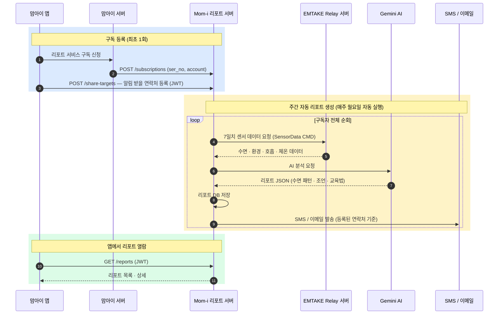

# Mom-i 리포트 서비스 전체 흐름

> mermaid.live 또는 Notion 코드블록(mermaid)에 붙여넣으면 이미지로 렌더링됩니다.

---

## API 목록 (리포트 서버 기준)

| 엔드포인트 | 인증 | 호출 주체 | 설명 |
|-----------|------|-----------|------|
| `POST /subscriptions` | X-API-Key | 맘아이 서버 | 구독 등록 |
| `DELETE /subscriptions/{ser_no}` | X-API-Key | 맘아이 서버 | 구독 해제 |
| `POST /share-targets` | JWT | 맘아이 앱 | 알림 수신자 추가 |
| `GET /share-targets` | JWT | 맘아이 앱 | 수신자 목록 조회 |
| `DELETE /share-targets/{id}` | JWT | 맘아이 앱 | 수신자 삭제 |
| `GET /reports` | JWT | 맘아이 앱 | 리포트 목록 조회 |
| `GET /reports/{id}` | JWT | 맘아이 앱 | 리포트 상세 조회 |

## 맘아이 서버가 제공해야 할 것

| 항목 | 용도 |
|------|------|
| `ser_no` | 기기 식별자 (구독 등록 시 전달) |
| `account` | EMTAKE 계정 이메일 (리포트 서버가 relay 호출에 사용) |
| JWT 발급 | 앱 → 리포트 서버 인증용 (HS256, `ser_no` 클레임 포함) |
